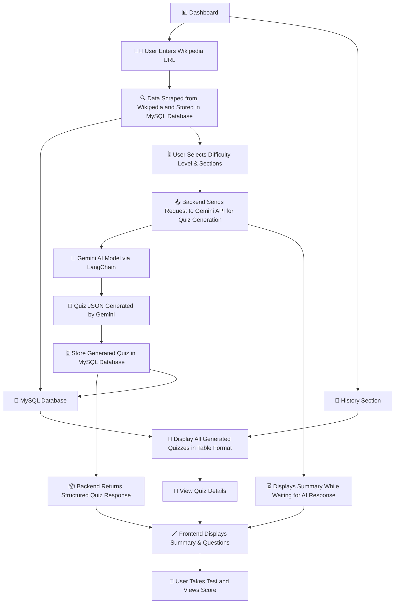

# 🧠 AI Quiz Generator

A full-stack **AI-powered Quiz Platform** that scrapes Wikipedia articles and generates multi-level quizzes using **Google Gemini API**.  
Built with **FastAPI (backend)**, **React + TailwindCSS (frontend)**, and **MySQL**, fully containerized with **Docker & Docker Compose**.

---

## 🚀 Features
✅ Scrapes and structures Wikipedia content  
✅ Generates quizzes using Gemini via LangChain  
✅ Semantic search with FAISS  
✅ Stores and retrieves quizzes from MySQL  
✅ Beautiful frontend UI built with React + TailwindCSS  
✅ Complete Dockerized setup for local and cloud deployment  

---

## ⚙️ Tech Stack
| Layer | Technology |
|--------|-------------|
| **Frontend** | React 19, Vite, TailwindCSS |
| **Backend** | FastAPI, LangChain, Gemini (Google Generative AI) |
| **Database** | MySQL 8 (Dockerized) |
| **AI Model** | Gemini 2.5 Flash |
| **Vector Search** | FAISS |
| **Containerization** | Docker & Docker Compose |

---

## 📦 Setup Guide

### 1️⃣ Clone the Repository
```bash
git clone https://github.com/yourusername/ai-quiz-generator.git
cd ai-quiz-generator
```
### 2️⃣ Configure Environment Variables
Create a .env file inside the backend/ folder:

```bash
GEMINI_API_KEY=your_gemini_api_key
GOOGLE_API_KEY=your_gemini_api_key
DATABASE_URL=mysql+pymysql://root:your_password@db:3306/ai_quiz_db
💡 Replace your_gemini_api_key and your_password with actual credentials.
```
### 3️⃣ Run the App (Dockerized)
Build and run all services together:

```bash
docker-compose up --build
Wait for all containers (frontend, backend, db) to start successfully.
```
##### Access:

🖥️ **Frontend**: http://localhost:5173

⚙️ **Backend (Swagger Docs)**: http://localhost:8000/docs

🗄️ **MySQL**: localhost:3310 (username: root / password: your_password)

---

## 🔗 API Endpoints (FastAPI)
| Method |	Endpoint |	Description |
|--------|-----------|-------------|
| GET |	/health |	Check backend health status |
| POST	| /generate_quiz |	Scrape Wikipedia article & store raw text |
| PUT |	/generate_quiz |	Generate quiz using Gemini & update database |
| GET |	/history |	Fetch all stored quizzes |
| GET |	/quiz/{quiz_id} |	Fetch a specific quiz by ID |

---
## 🧭 Application Flow

The **AI Quiz Generator** follows a modular architecture connecting the **Frontend**, **Backend**, **Database**, and **Gemini AI model**, enabling smooth interaction between data scraping, quiz generation, and visualization.


---

## 📸 Screenshots
<table align="center"> <tr> <td align="center"></td> <td align="center"></td> </tr> <tr> <td align="center"></td> <td align="center"></td> </tr> <tr> <td align="center"></td> <td align="center"></td> </tr> <tr> <td colspan="2" align="center"></td> </tr> <tr> <td colspan="2" align="center"></td> </tr> </table>

#### Output JSON Format
```json
{
  "id": 7,
  "url": "https://en.wikipedia.org/wiki/Defence_Research_and_Development_Organisation",
  "title": "Defence Research and Development Organisation",
  "summary": "The Defence Research and Development Organisation (DRDO) was established in 1958 by combining the Defence Science Organisation and technical development establishments. It has been instrumental in developing a comprehensive range of defence technologies, from missiles to aircraft avionics and artillery systems. DRDO is currently undergoing reforms and shifting its focus towards next-generation technologies while increasing collaboration with the private sector for conventional systems.",
  "key_entities": {
    "people": [
      "A. K. Antony",
      "K. Vijayraghavan",
      "Dr. B.K. Das"
    ],
    "organizations": [
      "DRDO",
      "Indian Ministry of Defence",
      "Indian Armed Forces",
      "Defence Technology Commission",
      "Hindustan Aeronautics Limited",
      "ISRO",
      "FICCI"
    ],
    "locations": [
      "Odisha coast",
      "Hyderabad",
      "Lucknow",
      "Goa",
      "Mumbai",
      "Chandigarh",
      "Kolkata"
    ]
  },
  "sections": ["Defence", "Space", "Technology"],
  "quiz": [
    {
      "question": "When was the Defence Research and Development Organisation (DRDO) established?",
      "options": [
        "1980",
        "2007",
        "1958",
        "2010"
      ],
      "answer": "1958",
      "difficulty": "easy",
      "explanation": "The DRDO was established in 1958 by combining the Defence Science Organisation and some of the technical development establishments."
    },
    {
      "question": "What years did the Integrated Guided Missile Development Programme (IGMDP) run as an Indian Ministry of Defence programme?",
      "options": [
        "1970s to 1980s",
        "Early 1980s to 2007",
        "2007 to 2010",
        "2010 to 2024"
      ],
      "answer": "Early 1980s to 2007",
      "difficulty": "easy",
      "explanation": "IGMDP was an Indian Ministry of Defence programme between the early 1980s and 2007."
    },
    {
      "question": "Who was the defence minister who ordered the restructuring of the DRDO in 2010?",
      "options": [
        "K. Vijayraghavan",
        "Dr. B.K. Das",
        "A. K. Antony",
        "Manastu Space Technologies"
      ],
      "answer": "A. K. Antony",
      "difficulty": "easy",
      "explanation": "In 2010, the defence minister A. K. Antony ordered the restructuring of the DRDO."
    },
    {
      "question": "In what year did DRDO test India's first long-range hypersonic missile?",
      "options": [
        "2007",
        "2010",
        "2024",
        "2025"
      ],
      "answer": "2024",
      "difficulty": "easy",
      "explanation": "In 2024, DRDO tested India's first long-range hypersonic missile."
    },
    {
      "question": "Where was the maiden flight test of the Integrated Air Defence Weapon System (IADWS) conducted on August 23, 2025?",
      "options": [
        "Off the Goa coast",
        "Off the Mumbai coast",
        "Off the Odisha coast",
        "Off the Chennai coast"
      ],
      "answer": "Off the Odisha coast",
      "difficulty": "easy",
      "explanation": "On August 23, 2025, DRDO successfully conducted the maiden flight test of the Integrated Air Defence Weapon System (IADWS) off the Odisha coast."
    },
    {
      "question": "Which organization administers the Technology Development Fund (TDF) Scheme?",
      "options": [
        "Indian Ministry of Defence",
        "DRDO",
        "IIT Bombay",
        "Manastu Space Technologies"
      ],
      "answer": "DRDO",
      "difficulty": "easy",
      "explanation": "The Technology Development Fund (TDF) Scheme is a Ministry of Defence programme administered by the DRDO."
    },
    {
      "question": "What is a key measure identified to make DRDO effective in its functioning, as per the text?",
      "options": [
        "Merging with ISRO",
        "Establishing a Defence Technology Commission with the defence minister as chairman",
        "Relocating all labs to Hyderabad",
        "Focusing solely on conventional weapons"
      ],
      "answer": "Establishing a Defence Technology Commission with the defence minister as chairman",
      "difficulty": "medium",
      "explanation": "The key measures to make DRDO effective in its functioning include the establishment of a Defence Technology Commission with the defence minister as its chairman."
    },
    {
      "question": "What is the primary shift in focus for DRDO under its new strategy, DRDO 2.0?",
      "options": [
        "From next-generation technologies to conventional weapons",
        "From conventional weapons to civilian applications",
        "From conventional weapons to next-generation technologies",
        "From private sector collaboration to in-house development"
      ],
      "answer": "From conventional weapons to next-generation technologies",
      "difficulty": "medium",
      "explanation": "Under the new strategy known as DRDO 2.0, DRDO is shifting its focus from the development of conventional weapons to next-generation technologies like directed energy weapons, photonics, quantum systems, and artificial intelligence."
    }
  ]
}

```

## 🧪 Development & Testing
Run backend only:
```bash
docker-compose run backend
```
Run frontend (with hot reload):
```bash
cd frontend
npm install
npm run dev
```
Check database:
```bash
docker exec -it <mysql_container_id> mysql -u root -p
```

---

## ⚙️ Docker Configuration Summary
| Service	| Container Port |	Host Port |
|---------|-----------|-------|
| Frontend	| 5173	| 5173 |
| Backend |	8000	| 8000 |
| MySQL |	3306	| 3310 |

## Services:
**db** → MySQL with persistent volume db_data

**backend** → FastAPI + Gemini quiz service

**frontend** → React app served via Vite

## 🗂️ Project Structure
```css
.
├── backend
│   ├── main.py
│   ├── database.py
│   ├── scraper_service.py
│   ├── llm_quiz_generator.py
│   ├── models.py
│   └── requirements.txt
│
├── frontend
│   ├── src/
│   ├── vite.config.js
│   └── package.json
│
├── docker-compose.yml
└── README.md
```

## Bonus Points

- "Take Quiz" mode with user scoring.
- URL validation and preview (auto-fetch article title before processing).
- Store scraped raw HTML in database for reference.
- Caching to prevent duplicate scraping of the same URL.
- Section-wise question grouping in UI.

## ❓ Troubleshooting
Issue	Cause	Fix
Frontend not loading	Vite not listening on 0.0.0.0	Update Dockerfile to expose host
CORS error	API origin mismatch	Allow CORS in FastAPI and update VITE_API_BASE_URL
MySQL connection error	Wrong host in DATABASE_URL	Use db (not localhost) in the connection string

### ☁️ Deploying on Render (Optional)
Deploy backend as a Docker service (choose backend/ directory).

Deploy frontend as a Static Site or Docker app (choose frontend/).

Use Render’s Managed MySQL and update your DATABASE_URL.

Update .env files and redeploy both services.
