# 🧠 AI Quiz Generator

A full-stack **AI-powered Quiz Platform** that scrapes Wikipedia articles and generates multi-level quizzes using **Google Gemini API**.  
Built with **FastAPI (backend)**, **React + TailwindCSS (frontend)**, and **MySQL**, fully containerized with **Docker & Docker Compose**.

---

## 🚀 Features
✅ Scrapes and structures Wikipedia content  
✅ Generates quizzes using Gemini via LangChain  
✅ Semantic search with FAISS  
✅ Stores and retrieves quizzes from MySQL  
✅ Beautiful frontend UI built with React + TailwindCSS  
✅ Complete Dockerized setup for local and cloud deployment  

---

## ⚙️ Tech Stack
| Layer | Technology |
|--------|-------------|
| **Frontend** | React 19, Vite, TailwindCSS |
| **Backend** | FastAPI, LangChain, Gemini (Google Generative AI) |
| **Database** | MySQL 8 (Dockerized) |
| **AI Model** | Gemini 2.5 Flash |
| **Vector Search** | FAISS |
| **Containerization** | Docker & Docker Compose |

---

## 📦 Setup Guide

### 1️⃣ Clone the Repository
```bash
git clone https://github.com/yourusername/ai-quiz-generator.git
cd ai-quiz-generator
```
### 2️⃣ Configure Environment Variables
Create a .env file inside the backend/ folder:

```bash
GEMINI_API_KEY=your_gemini_api_key
GOOGLE_API_KEY=your_gemini_api_key
DATABASE_URL=mysql+pymysql://root:your_password@db:3306/ai_quiz_db
💡 Replace your_gemini_api_key and your_password with actual credentials.
```
### 3️⃣ Run the App (Dockerized)
Build and run all services together:

```bash
docker-compose up --build
Wait for all containers (frontend, backend, db) to start successfully.
```
##### Access:

🖥️ **Frontend**: http://localhost:5173

⚙️ **Backend (Swagger Docs)**: http://localhost:8000/docs

🗄️ **MySQL**: localhost:3310 (username: root / password: your_password)

---

## 🔗 API Endpoints (FastAPI)
| Method |	Endpoint |	Description |
|--------|-----------|-------------|
| GET |	/health |	Check backend health status |
| POST	| /generate_quiz |	Scrape Wikipedia article & store raw text |
| PUT |	/generate_quiz |	Generate quiz using Gemini & update database |
| GET |	/history |	Fetch all stored quizzes |
| GET |	/quiz/{quiz_id} |	Fetch a specific quiz by ID |

---
## 🧭 Application Flow

The **AI Quiz Generator** follows a modular architecture connecting the **Frontend**, **Backend**, **Database**, and **Gemini AI model**, enabling smooth interaction between data scraping, quiz generation, and visualization.

```mermaid
flowchart TD
    %% ====== MAIN USER FLOW ======
    Z[📊 Dashboard] --> A[🧑‍💻 User Enters Wikipedia URL]
    A --> B[🔍 Data Scraped from Wikipedia and Stored in MySQL Database]
    B --> W[💾 MySQL Database]
    B --> C[🎚️ User Selects Difficulty Level & Sections]
    C --> D[📤 Backend Sends Request to Gemini API for Quiz Generation]
    D --> Y[🤖 Gemini AI Model via LangChain]
    D --> E[⏳ Displays Summary While Waiting for AI Response]
    Y --> F[🧠 Quiz JSON Generated by Gemini]
    F --> G[🗄️ Store Generated Quiz in MySQL Database]
    G --> H[📦 Backend Returns Structured Quiz Response]
    G --> W
    H --> I[🪄 Frontend Displays Summary & Questions]
    E --> I
    I --> J[📝 User Takes Test and Views Score]

    %% ====== HISTORY FLOW ======
    Z --> K[📜 History Section]
    K --> L[📂 Display All Generated Quizzes in Table Format]
    W --> L
    L --> M[🔎 View Quiz Details]
    M --> I
```


---

## 📸 Screenshots
<table align="center"> <tr> <td align="center"></td> <td align="center"></td> </tr> <tr> <td align="center"></td> <td align="center"></td> </tr> <tr> <td align="center"></td> <td align="center"></td> </tr> <tr> <td colspan="2" align="center"></td> </tr> </table>


#### Output JSON Format
```json
{
  "id": 1,
  "url": "[https://en.wikipedia.org/wiki/Alan_Turing](https://en.wikipedia.org/wiki/Alan_Turing)",
  "title": "Alan Turing",
  "summary": "Alan Turing was a British mathematician and computer scientist...",
  "key_entities": {
    "people": ["Alan Turing", "Alonzo Church"],
    "organizations": ["University of Cambridge", "Bletchley Park"],
    "locations": ["United Kingdom"]
  },
  "sections": ["Early life", "World War II", "Legacy"],
  "quiz": [
    {
      "question": "Where did Alan Turing study?",
      "options": [
        "Harvard University",
        "Cambridge University",
        "Oxford University",
        "Princeton University"
      ],
      "answer": "Cambridge University",
      "difficulty": "easy",
      "explanation": "Mentioned in the 'Early life' section."
    },
    {
      "question": "What was Alan Turing's main contribution during World War II?",
      "options": [
        "Atomic research",
        "Breaking the Enigma code",
        "Inventing radar",
        "Developing jet engines"
      ],
      "answer": "Breaking the Enigma code",
      "difficulty": "medium",
      "explanation": "Detailed in the 'World War II' section."
    }
  ],
  "related_topics": ["Cryptography", "Enigma machine", "Computer science history"]
}

```

## 🧪 Development & Testing
Run backend only:
```bash
docker-compose run backend
```
Run frontend (with hot reload):
```bash
cd frontend
npm install
npm run dev
```
Check database:
```bash
docker exec -it <mysql_container_id> mysql -u root -p
```

---

## ⚙️ Docker Configuration Summary
| Service	| Container Port |	Host Port |
|---------|-----------|-------|
| Frontend	| 5173	| 5173 |
| Backend |	8000	| 8000 |
| MySQL |	3306	| 3310 |

## Services:
**db** → MySQL with persistent volume db_data

**backend** → FastAPI + Gemini quiz service

**frontend** → React app served via Vite

## 🗂️ Project Structure
```css
.
├── backend
│   ├── main.py
│   ├── database.py
│   ├── scraper_service.py
│   ├── llm_quiz_generator.py
│   ├── models.py
│   └── requirements.txt
│
├── frontend
│   ├── src/
│   ├── vite.config.js
│   └── package.json
│
├── docker-compose.yml
└── README.md
```
## ❓ Troubleshooting
Issue	Cause	Fix
Frontend not loading	Vite not listening on 0.0.0.0	Update Dockerfile to expose host
CORS error	API origin mismatch	Allow CORS in FastAPI and update VITE_API_BASE_URL
MySQL connection error	Wrong host in DATABASE_URL	Use db (not localhost) in the connection string

### ☁️ Deploying on Render (Optional)
Deploy backend as a Docker service (choose backend/ directory).

Deploy frontend as a Static Site or Docker app (choose frontend/).

Use Render’s Managed MySQL and update your DATABASE_URL.

Update .env files and redeploy both services.
